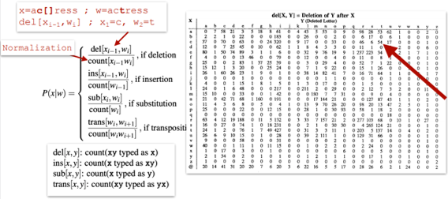

# Automatic Spell Checker

[](https://opensource.org/licenses/MIT)

Developing a context-aware spell checker that uses language modeling and error tables to efficiently correct spelling mistakes.

This project applies principles from language modeling and error analysis to build an automatic spelling correction system. It detects spelling errors, ranks potential corrections, and outputs the most contextually appropriate suggestion.

## :clipboard: Table of Contents
  * [Introduction](#bookmark_tabs-introduction)
  * [Goals and Features](#dart-goals-and-features)
  * [Data Description](#bar_chart-data-description)
  * [Pre-processing](#broom-pre-processing)
  * [Spell Checker Architecture](#hammer_and_wrench-spell-checker-architecture)
  * [Noisy Channel Model](#loud_sound-noisy-channel-model)
  * [Error Tables](#ledger-error-tables)
  * [Language Model](#brain-language-model)
  * [File Descriptions](#open_file_folder-file-descriptions)
  * [Usage](#computer-usage)

## :bookmark_tabs: Introduction
This project implements a spell checker capable of handling both non-word and real-word errors. The system uses the Noisy Channel Model to incorporate both the error likelihood (at a character level) and the probability of words within a sentence context to maximize the likelihood of the corrected sentence.

## :dart: Goals and Features
The project aims to develop a robust automatic spelling correction system. It will effectively identify and rectify misspelled words using the Noisy Channel Model and employ a Language Model to assess sentence context. This system will encompass several essential features, including:
- Supports corrections for both character-level and word-level errors.
- Handles up to two character-level errors in words and one erroneous word per sentence.
- Implements confusion matrices to manage error types and common spelling mistakes.
- Generates contextually accurate suggestions.
- Addresses various types of errors, including phonetic, typographic and contextual mistakes.

## :bar_chart: Data Description
The spell checker can work with any text-based data, and it processes input sentences or documents by identifying potential errors. While this project doesn't rely on a specific dataset, it uses predefined error tables that capture common spelling mistakes and utilizes language models trained on large corpora:
- Norvig’s big.txt: A large text corpus for language modeling.
- Error Tables: Based on the paper ["A Spelling Correction Program Based on a Noisy Channel Model"](https://aclanthology.org/C90-2036.pdf) (Kernighan et al., 1990), as well as a custom set of common misspellings.



## :broom: Pre-processing
The pre-processing phase includes:
- Text Normalization: Removing unnecessary characters, lowercasing and standardizing text formats.
- Tokenization: Splitting text into individual words or tokens.
- Error Analysis: Identifying potential spelling errors by comparing words against a dictionary and utilizing error tables for likely confusions.
- Context Extraction: Capturing the surrounding words of each identified error to assist in ranking correction suggestions.

## :hammer_and_wrench: Spell Checker Architecture
The spell-checking system is based on the following components:
- Error Tables: Mapping commonly misspelled characters or words.
- Language Model: An inner class within the `SpellChecker` class that ranks correction suggestions based on contextual probability.
- Correction Algorithm: A core algorithm that matches potential corrections to detected errors and ranks them by likelihood.

## :loud_sound: Noisy Channel Model
This model uses both the error type at the character level and the probability of word sequences to correct misspellings. The correction aims to maximize the likelihood of the full corrected sentence, considering prior word probabilities and likely character-level errors.

## :ledger: Error Tables
Confusion matrices based on common misspellings are used to guide corrections, which are integrated with the language model in a context-sensitive manner. The system is designed to correct up to two character-level errors in a word.

## :brain: Language Model
The `LanguageModel` (an inner class) supports:
- N-gram modeling for both words and characters.
- Sentence generation based on learned models.
- Smoothing for unseen n-grams.
- Evaluation of sentence likelihood in context.

## :open_file_folder: File Descriptions
Here’s a brief explanation of the key files in this repository:

#### 1. **error_tables.py**
This file contains pre-defined confusion matrices that represent common spelling mistakes. These matrices are a key component in the noisy channel model, as they quantify the likelihood of one character being mistakenly substituted, inserted, deleted or transposed into another.

#### 2. **spell_checker.py**
This is the core file of the project. It implements the `SpellChecker` class, which combines the Noisy Channel Model with the language model and error matrices to correct spelling mistakes. It includes methods to add language models and error tables, perform spell checking and evaluate text.

#### 3. **text_utils.py**
This file contains utility functions to handle and normalize text data. It includes functions to clean, tokenize and normalize sentences, which are crucial for pre-processing input text before it is passed to the spell checker.

#### 4. **main.py**
The entry point for running the spell checker. This file provides a user-friendly interface to load the language model, error tables, and perform spell checking on input text. It demonstrates how to integrate the various components of the spell checker.

#### 5. **requirements.txt**
This file lists all the Python dependencies required to run the project. It ensures that all necessary libraries are installed for successful execution of the spell checker.

## :computer: Usage
To use the spell checker:
1. Clone the repository and install the dependencies listed in `requirements.txt`.
2. Run the script from `main.py`, which demonstrates how to input text and receive corrected outputs.
3. Example command:
   ```bash
   python main.py "This is an exmple of a sentence with spelling errobs."
   ```
4. The output will provide the corrected sentence:
   `"This is an example of a sentence with spelling errors."`
